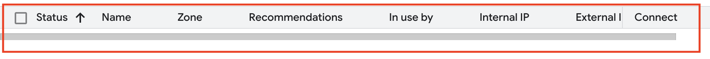

# VM Lifecycle on GCP and OCI — Tutorial

## Video

### Oracle Cloud (OCI)
🔗 Loom: [OCI VM Lifecycle Demo](https://www.loom.com/share/2c348540d16b47fea0777c70d371a909?sid=c9d4c7ba-fcab-4d1e-baa2-ae441d16910c)

### Google Cloud Platform (GCP)
🔗 Loom: [GCP VM Lifecycle Demo](https://www.loom.com/share/1cdce78a3db04af3b748824900dff973?sid=6e16946d-c755-4bff-a7ee-f09e8274ff0b)

## Prereqs
* Access to Google Cloud Platform (GCP) and Oracle Cloud Infrastructure (OCI)
* Use smallest/free-tier eligible VM shapes
* No PHI/PII stored on VMs

## Google Cloud (GCP)

### Create
* Console → *Compute Engine → VM instances → Create instance*
* **Region/zone:** US East (Northern Virginia), any zone
* **Machine type:** `E2-micro` (free-tier eligible: 2 vCPUs, 1 GB RAM)
* **Image:** Ubuntu Minimal (Ubuntu 25.04 Minimal)
* **Boot disk:** Balanced persistent disk, 10 GB
* **Network:** default VPC, ephemeral public IP

#### Creation

### Start/Stop
* **Start:** VM shows as **Running**
* **Stop:** VM shows as **Terminated/Stopped**

#### Start

#### Running

#### Stop

#### Terminated

#### Delete
* Delete the instance entirely
* Verify cleanup:
   * *Compute Engine → Disks* → no orphaned disks
   * *VPC network → External IP addresses* → ephemeral IP released, no static IPs remain

#### Deletion

## Oracle Cloud (OCI)

### Create
* Console → *Compute → Instances → Create instance*
* **Compartment:** `jonathanjafari`
* **Availability domain:** AD-3
* **Shape:** `VM.Standard.E2.1.Micro` (Always Free eligible, 1 OCPU, 1 GB RAM)
* **Image:** Canonical Ubuntu 20.04 Minimal
* **Networking:** existing VCN (*test-cloud*) with internet connectivity; existing subnet
* **Public IP:** ephemeral
* **Boot volume:** default minimal
* **SSH keys:** generate key pair and download

#### Creation

### Start/Stop
* **Start:** VM shows as **Running**
* **Stop:** VM shows as **Stopped**

#### Start

#### Stop

#### Running

#### Stopped

### Terminate
* Terminate instance
* Select *Delete boot volume*
* Verify cleanup:
   * *Storage → Block Storage → Block Volumes* → no volumes remain
   * *Networking → IP Management → Reserved Public IPs* → empty
* Note: terminated instances remain listed in OCI for history, but no resources are active

#### Terminate

#### Terminated

#### Cleaned Storage

#### Cleaned Networking

## Reflections

### Similarities
* Both platforms follow the same lifecycle: create → start → stop → terminate → cleanup.
* Both require attention to networking and storage to avoid hidden charges.

### Differences
* **Terminology:** GCP uses *projects/zones/instances*; OCI uses *compartments/availability domains/shapes*.
* **Networking:** GCP auto-assigns an ephemeral IP; OCI requires explicit assignment.
* **Cleanup:** GCP automatically deletes boot disks and ephemeral IPs; OCI requires checking *delete boot volume* and confirming no reserved IPs remain.
* **UI/UX:** GCP's interface is simpler with streamlined defaults; OCI has more steps and exposes more detail.
* **Instance deletion:** GCP removes deleted instances from the list; OCI keeps terminated ones visible for history.

### Preference
* I preferred **GCP** for this lab. The workflow was faster and clearer, with sensible defaults and automatic cleanup. OCI offers more granular control, but that comes at the cost of extra steps and a more complex interface.